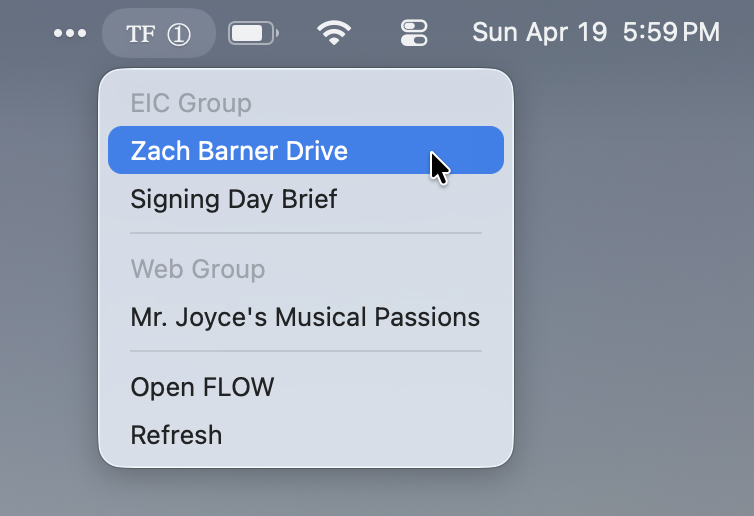

# Forum Badge

A tiny Mac menu-bar app that shows you, at a glance, how many stories have
been submitted to your FLOW groups.

## Download

  

Drag **ForumBadge.app** into `/Applications`, open it, and enter the password
your editor gave you. That's it.

## Features

- **Live submission counts in your menu bar.** One number per group — no
  dashboards, no tabs to keep open.
- **Click through to the story.** Left-click the badge for a dropdown of story
  titles; click a title to jump straight to the Google Doc.
- **Pick what you care about.** For each group, choose *Off*, *Count only*, or
  *Menu + count*. Turn off the groups that aren't yours.
- **Silent after setup.** The icon lives in the menu bar, re-launches when
  you log in, and stays out of your Dock.
- **One password, set once.** Preferences hide behind a password your editor
  configures. Nothing to remember day-to-day.
- **Refreshes on its own.** Counts update in the background. Hit *Refresh* in
  the menu if you don't want to wait.

## How it works

Forum Badge talks to a small self-hosted server that your editor runs. The
server holds the FLOW session, and your Mac app reads counts from it. You
never see any of that — just the badge.

## For editors / developers

- Run your own server: [`server/README.md`](server/README.md)
- Build the Mac app from source: [`client/README.md`](client/README.md)
